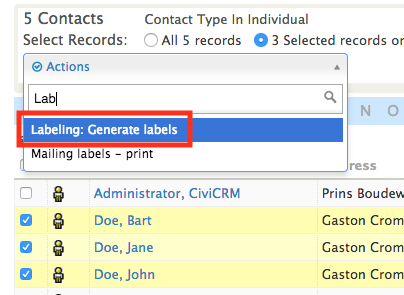
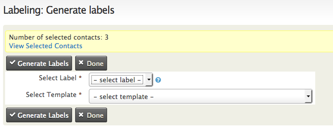

# CiviCRM extension: Labeling

Labeling is a CiviCRM extension that generates labels based on message templates.
- [Installation](#installation)

## Installation

- You can directly clone to your CiviCRM extension directory using<br>
```$ git clone https://github.com/kewljuice/be.ctrl.labeling.git```

- You can also download a zip file, and extract in your extension directory<br>
```$ git clone https://github.com/kewljuice/be.ctrl.labeling/archive/master.zip```

- Configure CiviCRM Extensions Directory which can be done from<br>
```"Administer -> System Settings -> Directories".```

- Configure Extension Resource URL which can be done from<br>
```"Administer -> System Settings -> Resource URLs".```

- The next step is enabling the extension which can be done from<br> 
```"Administer -> System Settings -> Manage CiviCRM Extensions".```

## Usage

- On the search page, select 'Labeling: Generate labels' as action.



- Select Label and Template and press 'Generate Labels'.



- The labels are created and downloaded.